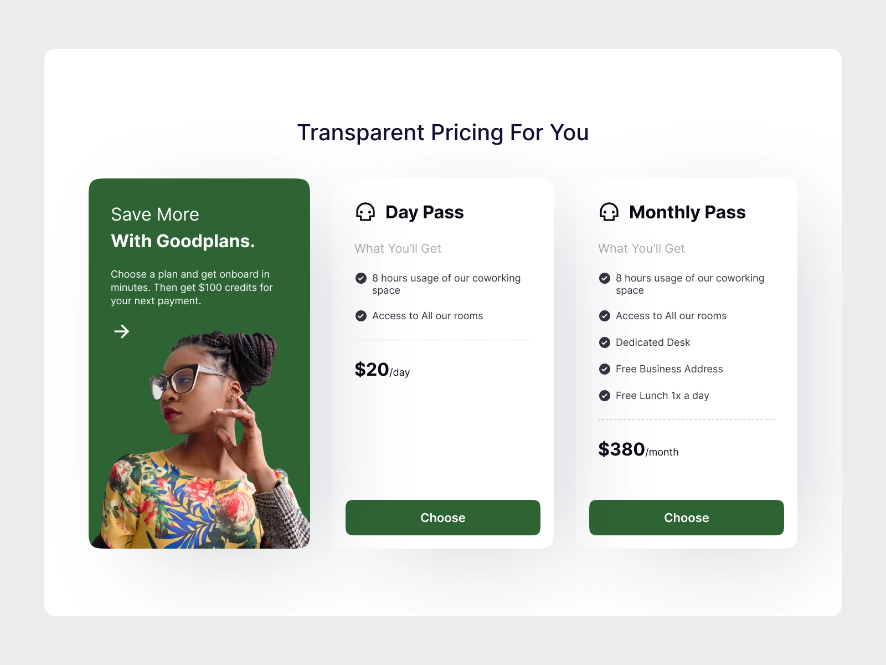

# React Base
1. Используйте [create-react-app](https://github.com/facebook/create-react-app)
1. Используйте typescript. [Add typescript for create-react-app](https://create-react-app.dev/docs/adding-typescript/)
1. Создайте с помощью react компонентов интерфейс из примера ниже

1. По клику на кнопку Choose выведите в консоль информацию о том, какой именно план был выбран: Day Pass or Monthly Pass
